# DeliverEase – Simplifying Logistics, Smartly

<p align="center">
  
</p>

DeliverEase is a logistics simulation platform that allows users to place, track, and manage deliveries with a realistic and interactive interface. Designed as a pure frontend application, it demonstrates the full flow of a logistics system—from order placement to vehicle tracking—using only **HTML**, **CSS**, **JavaScript**, **Geolocation API**, and **OpenStreetMap**.

---

## 🚩 The Problems DeliverEase Solves

DeliverEase is crafted to address multiple real-world inefficiencies and friction points in the local logistics ecosystem. Here's how it tackles common challenges:

### 🚧 Fragmented Order Systems
**Problem:** Most delivery services lack a unified interface for managing multi-stop deliveries, vehicle selection, and payment integration.  
**Solution:** DeliverEase offers an end-to-end parcel flow — from parcel type selection to payment — all in one seamless UI.

### 📍 Inaccurate Location Handling
**Problem:** Manually entering pickup or stop addresses leads to errors and inefficiencies.  
**Solution:** Uses the Geolocation API to auto-detect current pickup location and simplify address input.

### 📦 Parcel-Type Neglect
**Problem:** Perishable or fragile items often get mishandled due to lack of delivery context.  
**Solution:** Users explicitly label parcel types (perishable, fragile, etc.), ensuring appropriate handling and optimized route/vehicle selection.

### 🛣️ Inefficient Route Planning
**Problem:** Manual route planning doesn’t account for delivery stop sequencing or shortest paths.  
**Solution:** Dynamically calculates the shortest delivery route using delivery points and assigns the best vehicle type accordingly.

### 🔄 Lack of Real-Time Transparency
**Problem:** Users can’t visualize where their order is or how it’s progressing.  
**Solution:** Offers animated tracking maps, showing vehicle movement and delivery path with detailed step-by-step history.

### 💸 Payment Hassles
**Problem:** Many systems don’t support flexible or multiple payment options.  
**Solution:** Accepts Card, UPI, and Cash, with instant receipt generation and print option.

---

## ✨ Key Features

### 📦 Order Placement Flow

- Select **order type**: _Perishable_, _Fragile_, or _Normal_
- Set **delivery priority**: _Standard_, _Express_, or _Urgent_
- Enter **pickup location** manually or use **Geolocation API** to auto-fill
- Add **multiple delivery stops** dynamically
- Smart UI flows to keep order creation intuitive

### 🚗 Vehicle Selection & Smart Pricing

- Choose vehicle based on:
  - Parcel **size**, **weight**, and **cost**
- System calculates **shortest delivery route** based on stops
- Generates **final delivery cost** using:
  - Distance, weight, parcel type, and vehicle
- Accept route and **proceed to payment**

### 💳 Payment & Receipt

- Supports **Card**, **UPI**, and **Cash on Delivery**
- Generates a **digital receipt** with order details
- Option to **print receipt** directly from browser

### 🛰️ Real-Time Order Tracking

- View and **filter orders** by status: _Pending_, _In Transit_, _Delivered_
- Each order card shows essential order details
- Users can:
  - **Track** via animated map view
  - **Cancel** orders
  - **Pay pending** orders

### 🗺️ Interactive Tracking Map

- On tracking:
  - **Modal opens** with animated vehicle movement on route
  - **Route drawn** between pickup and delivery points
  - All **address points** labeled clearly
  - Below map: Timeline of route steps & delivery history

### 📋 Additional Pages

- 📝 **Feedback Page** – share delivery experience
- 📜 **Terms & Conditions**
- 📞 **Contact Us** – submit queries or support requests

---

## 🧱 Tech Stack

| Tech            | Purpose                             |
| --------------- | ----------------------------------- |
| HTML5           | Structure of the app                |
| CSS3            | Styling and layout                  |
| JavaScript      | Core logic and user interaction     |
| Geolocation API | Detect user’s current location      |
| OpenStreetMap   | Render maps and calculate routes    |
| Leaflet.js      | Map rendering and marker animations |

---

## 🖼️ Preview

### 🏠 Home Page

<table align="center">
  <tr>
    <td align="center">
      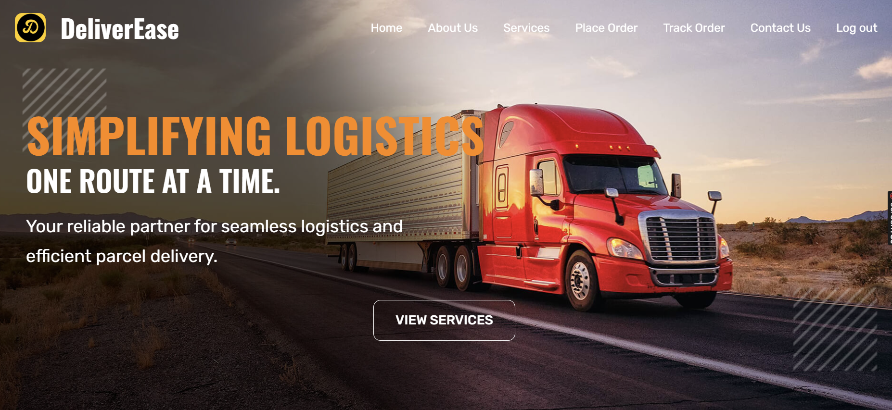<br/>
      <strong>🎯 Hero Section</strong>
    </td>
    <td align="center">
      <br/>
      <strong>📚 How It Works</strong>
    </td>
  </tr>
  <tr>
    <td align="center">
      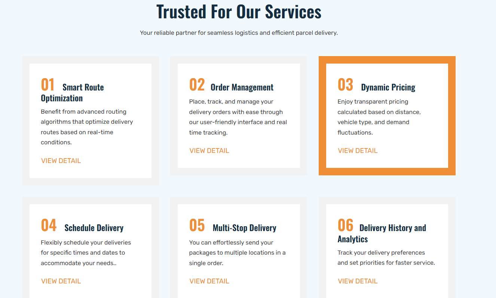<br/>
      <strong>⚙️ Features Overview</strong>
    </td>
    <td align="center">
      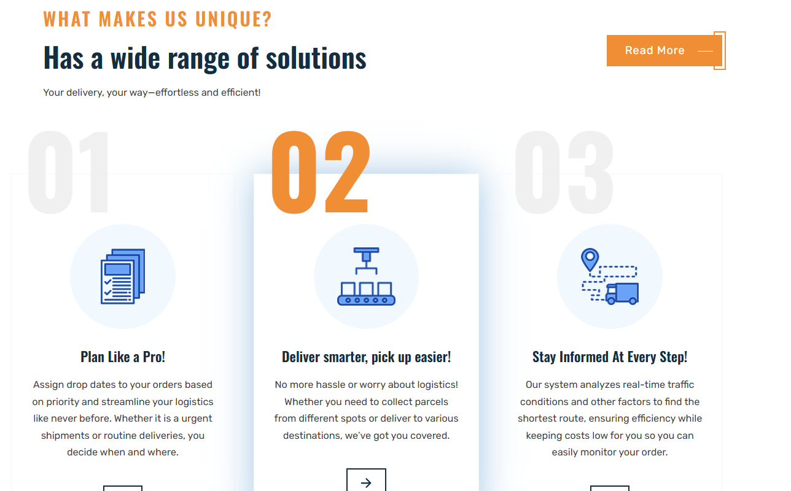<br/>
      <strong>📩 Footer & Navigation</strong>
    </td>
  </tr>
</table>

---

### 📦 Place Order Flow

<table align="center">
  <tr>
    <td align="center">
      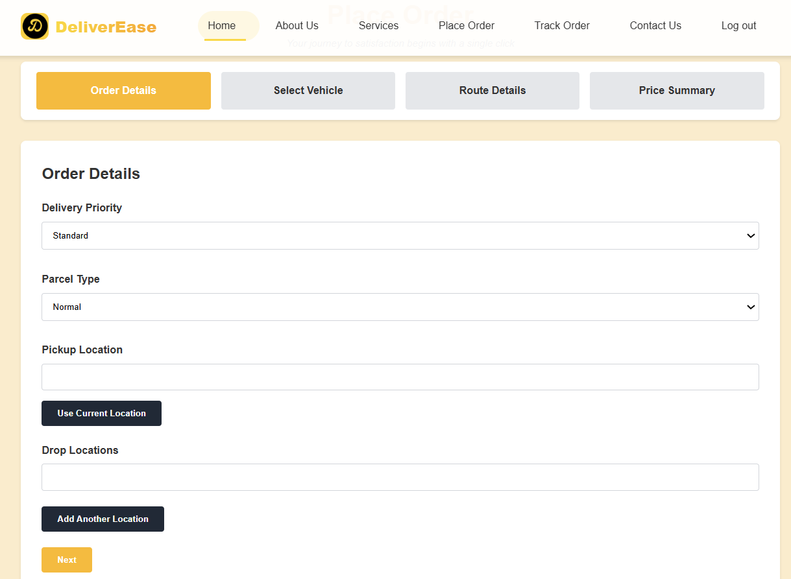<br/>
      <strong>🛒 Parcel Type, Pickup, & Stops</strong>
    </td>
    <td align="center">
      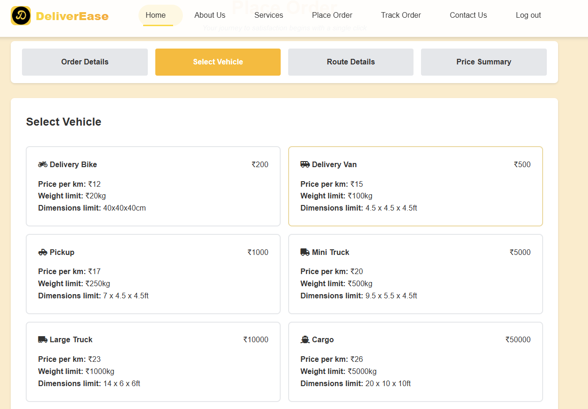<br/>
      <strong>🚛 Vehicle Selection</strong>
    </td>
  </tr>
  <tr>
    <td align="center">
      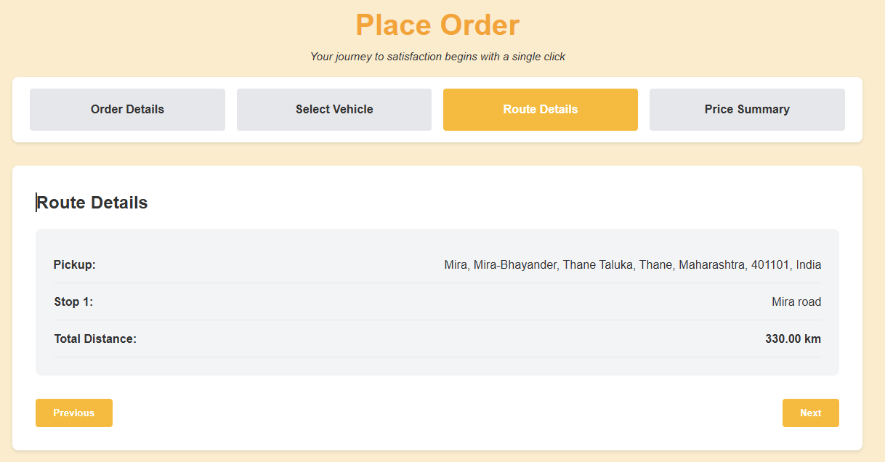<br/>
      <strong>🧭 Route & Cost Calculation</strong>
    </td>
    <td align="center">
      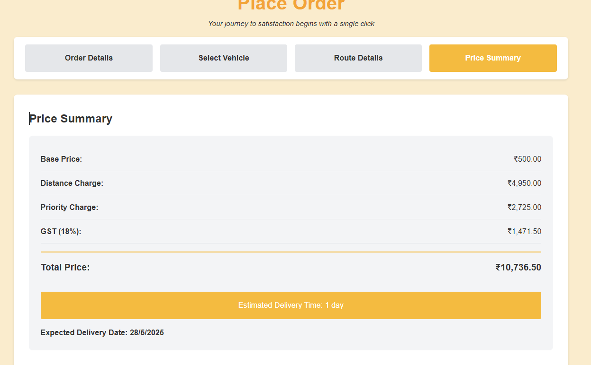<br/>
      <strong>➕ Price Summary</strong>
    </td>
  </tr>
  <tr>
    <td align="center">
      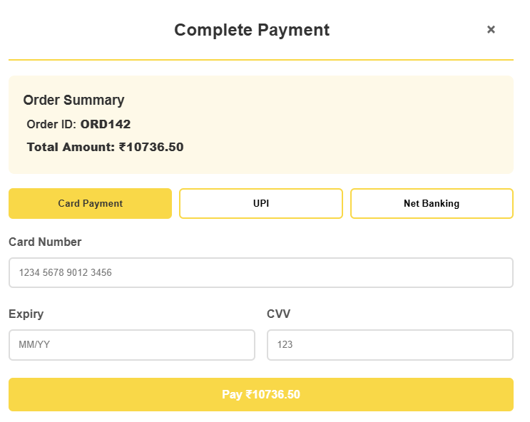<br/>
      <strong>💳 Payment & Receipt</strong>
    </td>
    <td align="center">
      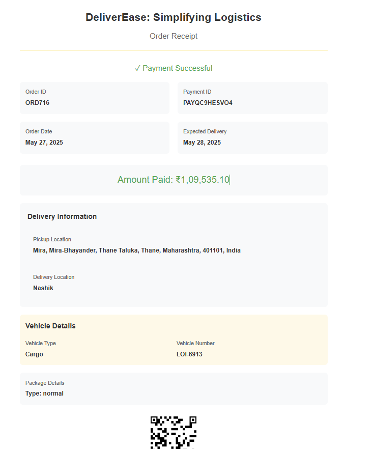<br/>
      <strong>📍 Booking Receipt</strong>
    </td>
  </tr>
</table>

---

### 🛰️ Track Order

<table align="center">
  <tr>
    <td align="center">
      <br/>
      <strong>📦 View & Filter Orders</strong>
    </td>
    <td align="center">
      <br/>
      <strong>📍 Animated Route Tracking</strong>
    </td>
  </tr>
</table>

---

### 📋 Feedback & Info Pages

<table align="center">
  <tr>
    <td align="center">
      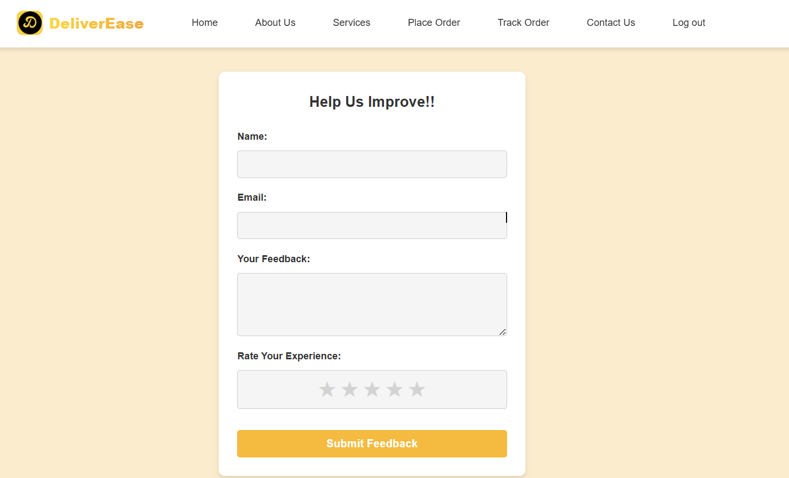<br/>
      <strong>✍️ Submit Feedback</strong>
    </td>
    <td align="center">
      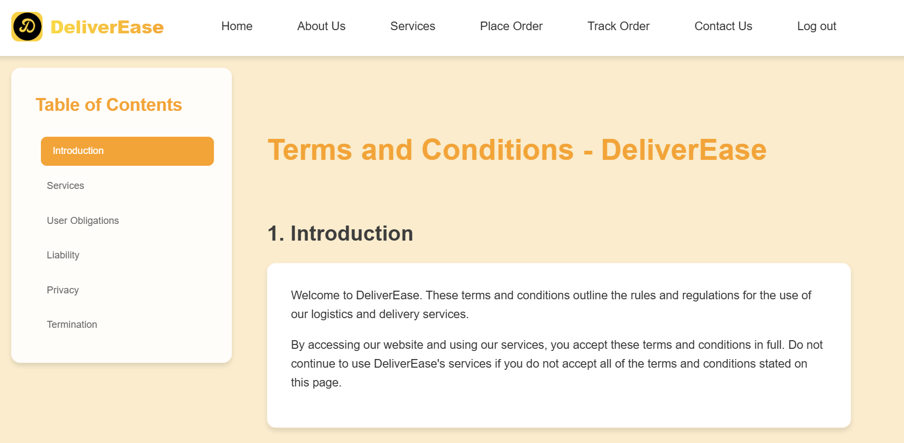<br/>
      <strong>📜 Terms & Conditions</strong>
    </td>
  </tr>
</table>

---

## 🛠️ Setup Instructions

```bash
git clone https://github.com/Anish-Tripathi/DeliverEase.git
cd DeliverEase

# Just open assets/html/index.html in your browser
```

✅ No installations needed. Just clone and run.

---

## 🧩 Project Structure

```
DeliverEase/
├── assets/
│   ├── css/           # Stylesheets
│   ├── html/          # HTML files (index.html, contact.html, terms.html, feedback.html, etc.)
│   ├── images/        # UI screenshots, icons, and image assets
│   └── js/            # JavaScript logic
├── node_modules/      # Node.js dependencies (if using npm for dev tools)
├── favicon.svg
├── logo.png
├── package.json
├── package-lock.json
├── README.md
└── style-guide.md
```

---

## 📈 Future Enhancements

- Integrate backend with Node.js or Firebase
- Real-time GPS tracking via mobile API
- Route optimization using A* or Google Maps Directions API
- Notification system for order status updates

---
