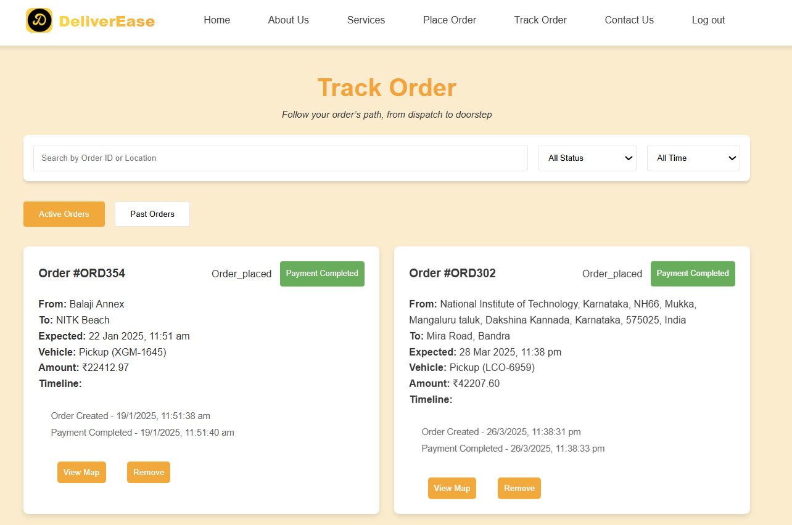

# 🚚 DeliverEase – Simplifying Logistics, Smartly

DeliverEase is a logistics simulation platform that allows users to place, track, and manage deliveries with a realistic and interactive interface. Designed as a pure frontend application, it demonstrates the full flow of a logistics system—from order placement to vehicle tracking—using only **HTML**, **CSS**, **JavaScript**, **Geolocation API**, and **OpenStreetMap**.

> 🔧 Built without a backend, DeliverEase intelligently simulates logistics processes with real-world mapping and user interactions.

---

## ✨ Key Features

### 📦 Order Placement Flow

- Select **order type**: _Perishable_, _Fragile_, or _Normal_
- Set **delivery priority**: _Standard_, _Express_, or _Urgent_
- Enter **pickup location** manually or use **Geolocation API** to auto-fill
- Add **multiple delivery stops** dynamically
- Smart UI flows to keep order creation intuitive

### 🚗 Vehicle Selection & Smart Pricing

- Choose vehicle based on:
  - Parcel **size**, **weight**, and **cost**
- System calculates **shortest delivery route** based on stops
- Generates **final delivery cost** using:
  - Distance, weight, parcel type, and vehicle
- Accept route and **proceed to payment**

### 💳 Payment & Receipt

- Supports **Card**, **UPI**, and **Cash on Delivery**
- Generates a **digital receipt** with order details
- Option to **print receipt** directly from browser

### 🛰️ Real-Time Order Tracking

- View and **filter orders** by status: _Pending_, _In Transit_, _Delivered_
- Each order card shows essential order details
- Users can:
  - **Track** via animated map view
  - **Cancel** orders
  - **Pay pending** orders

### 🗺️ Interactive Tracking Map

- On tracking:
  - **Modal opens** with animated vehicle movement on route
  - **Route drawn** between pickup and delivery points
  - All **address points** labeled clearly
  - Below map: Timeline of route steps & delivery history

### 📋 Additional Pages

- 📝 **Feedback Page** – share delivery experience
- 📜 **Terms & Conditions**
- 📞 **Contact Us** – submit queries or support requests

---

## 🧱 Tech Stack

| Tech            | Purpose                             |
| --------------- | ----------------------------------- |
| HTML5           | Structure of the app                |
| CSS3            | Styling and layout                  |
| JavaScript      | Core logic and user interaction     |
| Geolocation API | Detect user’s current location      |
| OpenStreetMap   | Render maps and calculate routes    |
| Leaflet.js      | Map rendering and marker animations |

---

## 🖼️ Preview

---

### 🏠 Home Page

<div align="center">

  
  <p><strong>🎯 Hero Section</strong></p>

  
  <p><strong>📚 How It Works</strong></p>

  
  <p><strong>⚙️ Features Overview</strong></p>

  
  <p><strong>📩 Footer & Navigation</strong></p>

</div>

---

### 📦 Place Order Flow

<div align="center">

  
  <p><strong>🛒 Select parcel type, set pickup via current location, and add delivery stops.</strong></p>

  
  <p><strong>🚛 Vehicle Selection</strong></p>

  
  <p><strong>🧭 Route & Cost Calculation</strong></p>

   
  <p><strong➕ Price Summary </strong></p>

  
  <p><strong>💳 Payment & Receipt Generation</strong></p>

  
  <p><strong>📍 Booking reciept</strong></p>

</div>

---

### 🛰️ Track Order

<div align="center">

  
  <p><strong>📦 Filter & View Orders</strong></p>

  
  <p><strong>📍 Animated Route Tracking with Map</strong></p>

</div>

---

### 📋 Feedback & Info Pages

<div align="center">

  
  <p><strong>✍️ Submit Feedback</strong></p>

  
  <p><strong>📜 Terms & Conditions</strong></p>

</div>

---

## 🚀 Getting Started

```bash
git clone https://github.com/Anish-Tripathi/DeliverEase.git
cd DeliverEase
# Just open assets/html/index.html in your browser
```

✅ No installations needed. Just clone and run.

---

## 🧩 Project Structure

```
DeliverEase/
├── assets/
│   ├── css/           # Stylesheets
│   ├── html/          # HTML files (index.html, contact.html, terms.html, feedback.html, etc.)
│   ├── images/        # UI screenshots, icons, and image assets
│   └── js/            # JavaScript logic
├── node_modules/      # Node.js dependencies (if using npm for dev tools)
├── favicon.svg
├── logo.png
├── package.json
├── package-lock.json
├── README.md
└── style-guide.md
```


---

## 📈 Future Enhancements

- Integrate backend with Node.js or Firebase
- Real-time GPS tracking via mobile API
- Route optimization using A\* or Google Maps Directions API
- Notification system for order status updates

---
